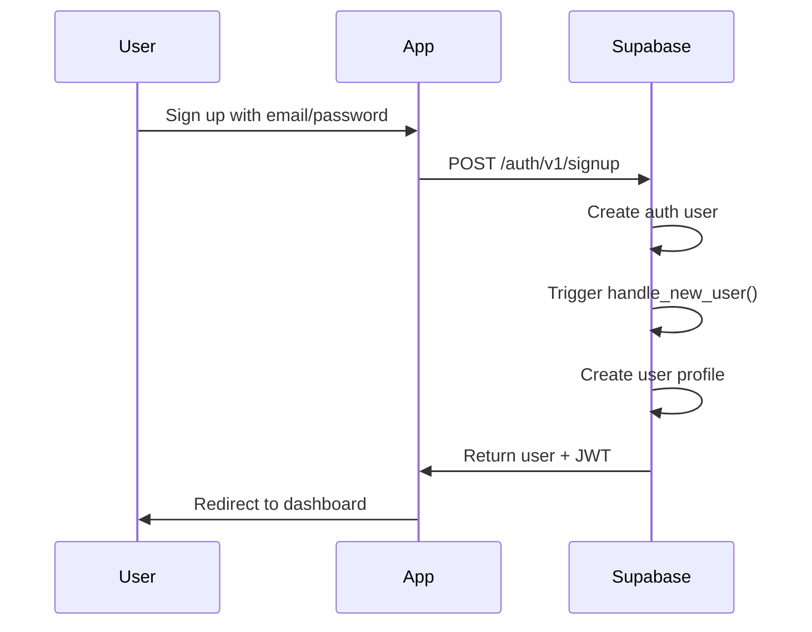
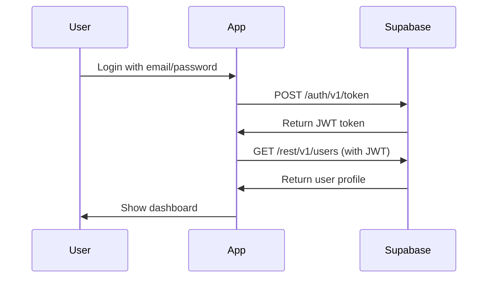
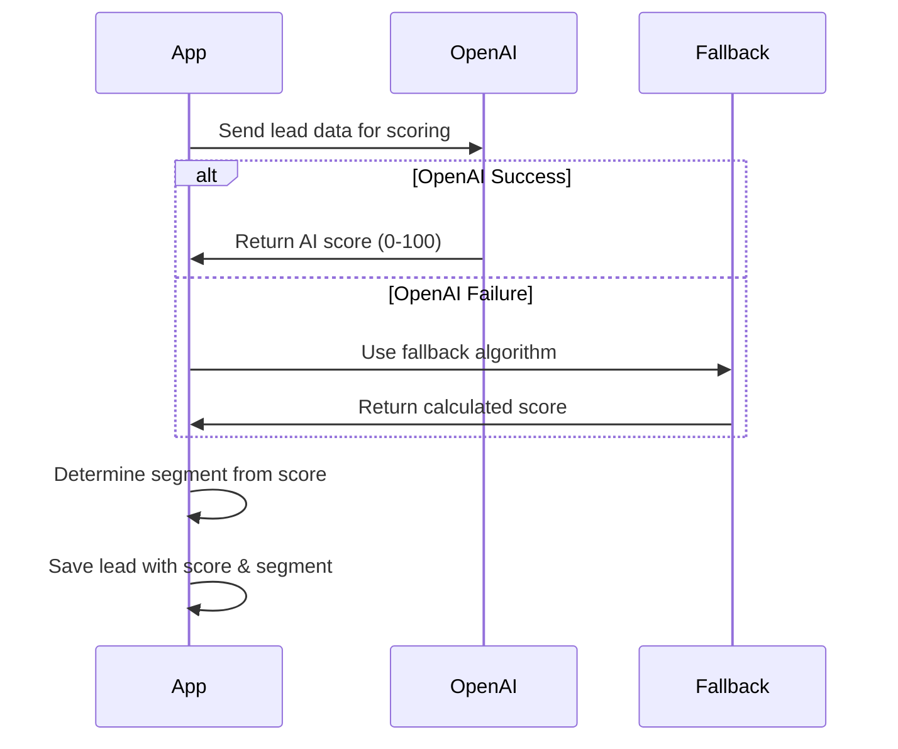
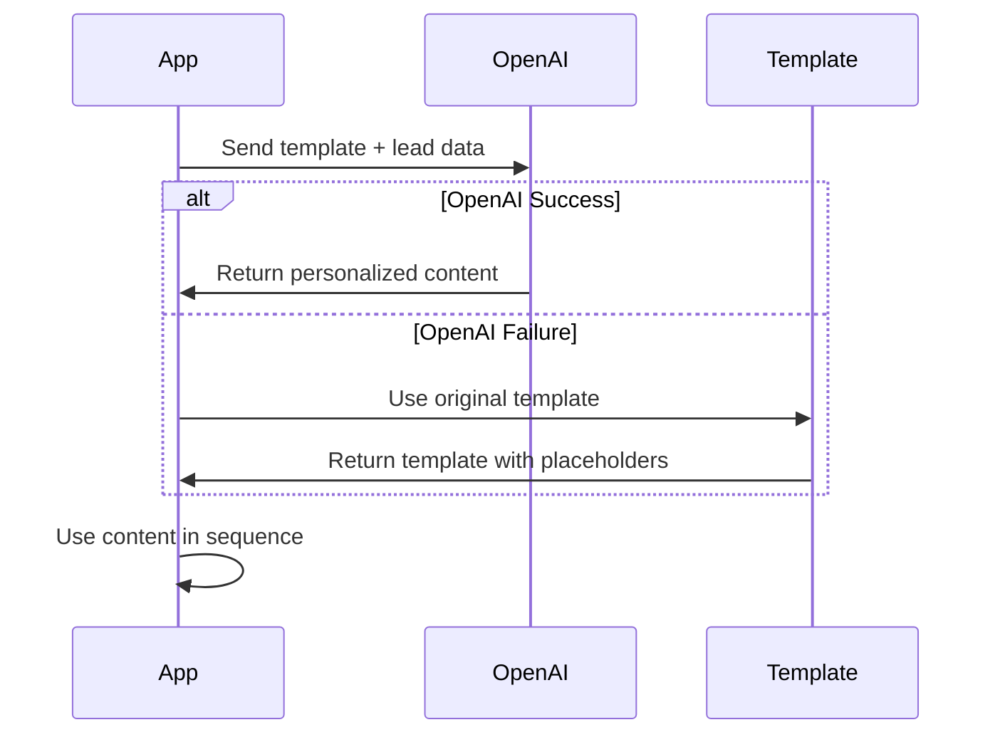
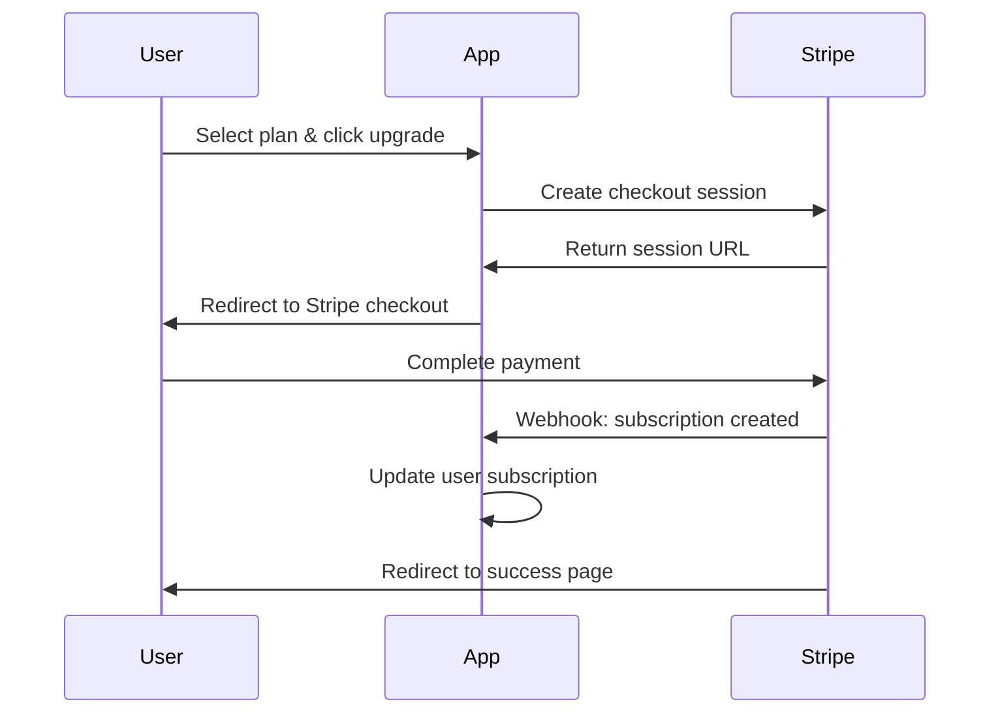

# LeadFlow AI API Documentation

This document outlines the API integrations and data flow for LeadFlow AI.

## 🔗 External API Integrations

### 1. Supabase API

**Purpose**: Backend as a Service for database, authentication, and real-time features

**Base URL**: `https://your-project.supabase.co`

#### Authentication Endpoints

```javascript
// Sign up
POST /auth/v1/signup
{
  "email": "user@example.com",
  "password": "password123",
  "data": {
    "name": "John Doe"
  }
}

// Sign in
POST /auth/v1/token?grant_type=password
{
  "email": "user@example.com",
  "password": "password123"
}

// Sign out
POST /auth/v1/logout
```

#### Database Endpoints

```javascript
// Get user leads
GET /rest/v1/leads?user_id=eq.{userId}
Headers: {
  "Authorization": "Bearer {jwt_token}",
  "apikey": "{anon_key}"
}

// Create lead
POST /rest/v1/leads
Headers: {
  "Authorization": "Bearer {jwt_token}",
  "apikey": "{anon_key}",
  "Content-Type": "application/json"
}
Body: {
  "user_id": "uuid",
  "name": "John Smith",
  "email": "john@company.com",
  "company": "Company Inc",
  "score": 85,
  "segment": "Hot"
}

// Update lead
PATCH /rest/v1/leads?id=eq.{leadId}
Headers: {
  "Authorization": "Bearer {jwt_token}",
  "apikey": "{anon_key}",
  "Content-Type": "application/json"
}
Body: {
  "score": 90,
  "segment": "Hot"
}
```

### 2. OpenAI API

**Purpose**: AI-powered lead scoring and content generation

**Base URL**: `https://api.openai.com`

#### Lead Scoring

```javascript
POST /v1/chat/completions
Headers: {
  "Authorization": "Bearer {api_key}",
  "Content-Type": "application/json"
}
Body: {
  "model": "gpt-3.5-turbo",
  "messages": [
    {
      "role": "user",
      "content": "Analyze this lead and provide a score from 0-100..."
    }
  ],
  "max_tokens": 10,
  "temperature": 0.3
}
```

#### Content Generation

```javascript
POST /v1/chat/completions
Headers: {
  "Authorization": "Bearer {api_key}",
  "Content-Type": "application/json"
}
Body: {
  "model": "gpt-3.5-turbo",
  "messages": [
    {
      "role": "user",
      "content": "Generate a personalized email for this lead..."
    }
  ],
  "max_tokens": 500,
  "temperature": 0.7
}
```

### 3. Stripe API

**Purpose**: Subscription management and payments

**Base URL**: `https://api.stripe.com`

#### Create Checkout Session

```javascript
POST /v1/checkout/sessions
Headers: {
  "Authorization": "Bearer {secret_key}",
  "Content-Type": "application/x-www-form-urlencoded"
}
Body: {
  "success_url": "https://yourapp.com/success",
  "cancel_url": "https://yourapp.com/cancel",
  "payment_method_types[]": "card",
  "line_items[0][price]": "price_pro_monthly",
  "line_items[0][quantity]": 1,
  "mode": "subscription",
  "customer_email": "user@example.com"
}
```

#### Create Customer Portal Session

```javascript
POST /v1/billing_portal/sessions
Headers: {
  "Authorization": "Bearer {secret_key}",
  "Content-Type": "application/x-www-form-urlencoded"
}
Body: {
  "customer": "cus_customer_id",
  "return_url": "https://yourapp.com/settings"
}
```

## 📊 Data Models

### User

```typescript
interface User {
  id: string
  email: string
  name: string
  subscription_plan: 'free' | 'pro' | 'business'
  connected_accounts: Record<string, any>
  created_at: string
  updated_at: string
}
```

### Lead

```typescript
interface Lead {
  id: string
  user_id: string
  name: string
  email: string
  company?: string
  title?: string
  phone?: string
  location?: string
  source?: string
  score: number // 0-100
  segment: 'Hot' | 'Warm' | 'Cold' | 'Nurture'
  status: 'New' | 'Contacted' | 'Qualified' | 'Converted' | 'Lost'
  last_activity: string
  external_crm_id?: string
  custom_fields: Record<string, any>
  created_at: string
  updated_at: string
}
```

### Sequence

```typescript
interface Sequence {
  id: string
  user_id: string
  name: string
  description?: string
  trigger_conditions: Record<string, any>
  is_active: boolean
  created_at: string
  updated_at: string
  sequence_steps?: SequenceStep[]
}
```

### SequenceStep

```typescript
interface SequenceStep {
  id: string
  sequence_id: string
  step_order: number
  step_type: 'email' | 'delay' | 'condition' | 'action'
  content: Record<string, any>
  delay_days: number
  created_at: string
  updated_at: string
}
```

### LeadActivity

```typescript
interface LeadActivity {
  id: string
  lead_id: string
  activity_type: 'email_sent' | 'email_opened' | 'email_clicked' | 'website_visit' | 'form_submit' | 'call_made' | 'meeting_scheduled' | 'note_added'
  activity_details: Record<string, any>
  timestamp: string
}
```

## 🔐 Authentication Flow

### 1. User Registration



### 2. User Login



## 🤖 AI Integration Flow

### Lead Scoring Process



### Content Generation Process



## 💳 Subscription Flow

### Checkout Process



## 🔄 Real-time Features

### Database Changes

Supabase provides real-time subscriptions for database changes:

```javascript
// Listen for lead updates
const subscription = supabase
  .channel('leads')
  .on('postgres_changes', 
    { 
      event: '*', 
      schema: 'public', 
      table: 'leads',
      filter: `user_id=eq.${userId}`
    }, 
    (payload) => {
      console.log('Lead updated:', payload)
      // Update UI accordingly
    }
  )
  .subscribe()
```

## 🛡️ Security Considerations

### Row Level Security (RLS)

All database tables have RLS policies ensuring users can only access their own data:

```sql
-- Example policy for leads table
CREATE POLICY "Users can view own leads" ON leads
  FOR SELECT USING (auth.uid() = user_id);
```

### API Key Management

- **OpenAI**: API key stored in environment variables, calls made from client (consider backend proxy for production)
- **Stripe**: Publishable key on client, secret key on backend only
- **Supabase**: Anon key on client, service key on backend only

### Rate Limiting

Implement rate limiting for:
- AI API calls (to manage costs)
- Database operations (to prevent abuse)
- Authentication attempts (to prevent brute force)

## 📈 Performance Optimization

### Caching Strategy

- **Database queries**: Cache frequently accessed data
- **AI responses**: Cache common scoring patterns
- **Static assets**: Use CDN for images and files

### Pagination

Implement pagination for large datasets:

```javascript
// Example: Paginated leads query
const { data, error } = await supabase
  .from('leads')
  .select('*')
  .eq('user_id', userId)
  .range(start, end)
  .order('created_at', { ascending: false })
```

## 🔍 Error Handling

### API Error Responses

All APIs should return consistent error formats:

```javascript
{
  "error": {
    "code": "INVALID_REQUEST",
    "message": "The request is invalid",
    "details": {
      "field": "email",
      "issue": "Email format is invalid"
    }
  }
}
```

### Fallback Mechanisms

- **Database failures**: Fall back to local state
- **AI failures**: Use rule-based algorithms
- **Payment failures**: Graceful degradation of features

## 📝 API Testing

### Test Endpoints

Use tools like Postman or curl to test API endpoints:

```bash
# Test lead creation
curl -X POST 'https://your-project.supabase.co/rest/v1/leads' \
  -H 'Authorization: Bearer YOUR_JWT_TOKEN' \
  -H 'apikey: YOUR_ANON_KEY' \
  -H 'Content-Type: application/json' \
  -d '{
    "name": "Test Lead",
    "email": "test@example.com",
    "company": "Test Company"
  }'
```

### Integration Testing

Test the complete flow:
1. User registration
2. Lead creation with AI scoring
3. Sequence creation and execution
4. Analytics data retrieval

This API documentation provides a comprehensive overview of all integrations and data flows in LeadFlow AI.
